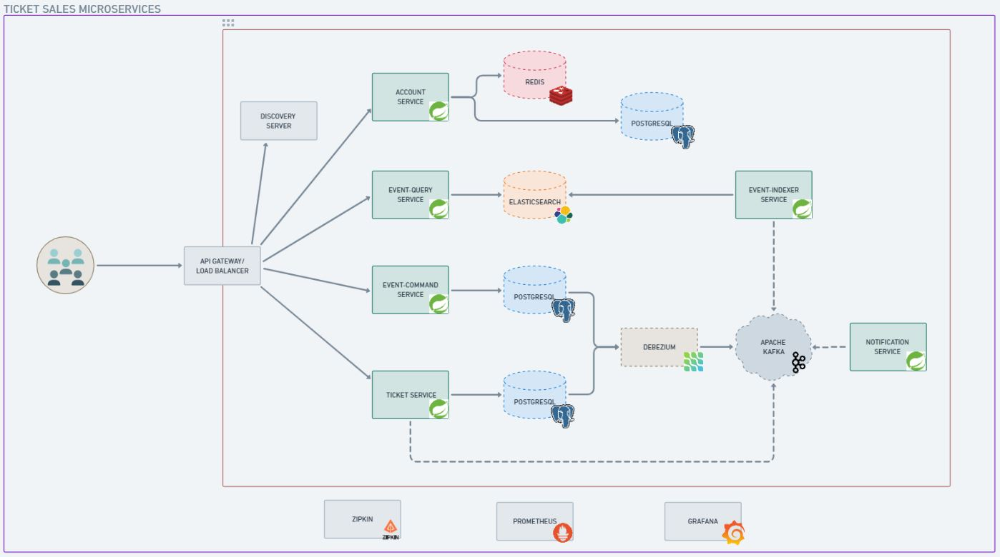
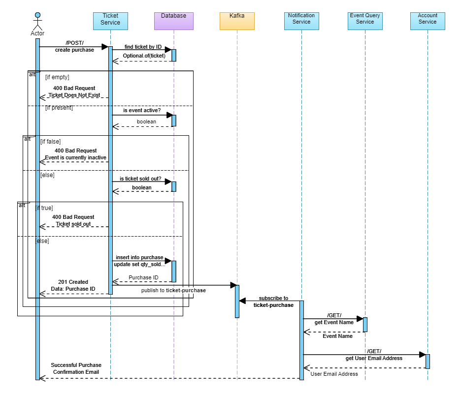
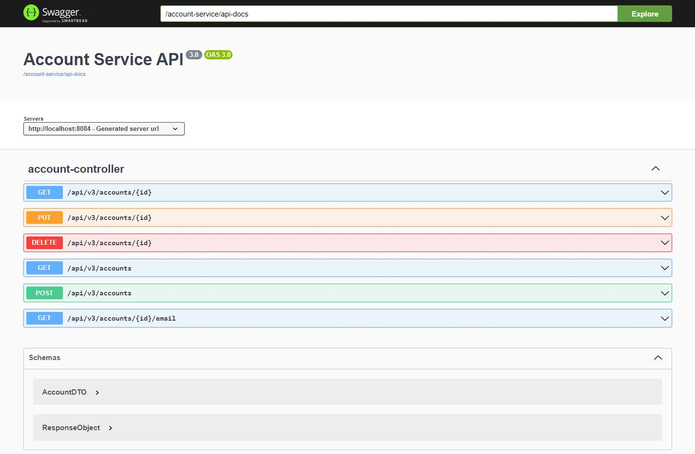

        

# TICKET SALES MICROSERVICES

_Organize events and purchase tickets from different services._

| Links                                                                                                                                                  | Description    |
| ------------------------------------------------------------------------------------------------------------------------------------------------------ | -------------- |
| [](https://github.com/gestanestle/ticket-sales-microservices/tree/v2.1) | Backend - v2.1 |
| [](https://github.com/gestanestle/ticket-sales-microservices/tree/v2.0) | Backend - v2.0 |
| [](https://github.com/gestanestle/ticket-sales-microservices/tree/v1.0) | Backend - v1.0 |

### Technologies

Ticket Sales Microservices uses a number of tools and frameworks to work properly:

- Java, PostgreSQL, Redis, Elasticsearch
- Spring Boot - Web, Actuator
- Spring Cloud - Eureka Server/Client, API Gateway
- Spring 5 WebFlux - WebClient
- Spring Data JPA, Spring JDBC, Flyway
- Spring Data Redis, Jedis
- Java API Client for Elasticsearch
- JUnit, Mockito, MockMVC, Test Containers
- Java Mail Sender, Gmail SMTP
- Apache Kafka, Zookeeper
- Debezium
- Docker, Docker Compose
- Zipkin
- Prometheus
- Grafana
- Swagger

## THE ARCHITECTURE



Ticket Sales Microservices is a backend system that lets you:

- Create, update, and delete events
- Set ticket details for the created events
- Search and purchase ticket for events

_A fairly simple application in a distributed architecture._

### Event-Driven and Change Data Capture

This ticket sales system is based on event-driven paradigm, utilizing Apache Kafka as the message broker.
It is not the applications themselves that directly publish the records to Kafka but Debezium -
a third party CDC tool that captures row-level changes in our source database (PostgreSQL).
It guarantees at-least once delivery semantics for every message.

**Debezium + Kafka act as a streaming pipeline to pass data to other services.** <br>
<br>
In our microservices, this pipeline is being used for two distinct purposes:

- To sync the data between read and write models for entity `Event`
- To persist Event aggregate to Ticket Service's datastore

Ticket Service, on the other hand, makes use of Kafka to directly publish data to topic in order to process notifications upon `Ticket` Purchase.

> _Note that `Event` here refers to the aggregate root - the main entity this entire system
> cannot live without. This must not be confused with the term **domain events**._

### Command and Query Responsibility Segregation

Commands and queries for `Event` are separated. Addition of new `Event`, modification, and deletion
are done through Event Command Service. On the other hand, querying events - searching per keyword and getting per ID -
can only be done through Event Query Service.

Elasticsearch, a distributed search engine, is used to create a highly available read model with
Full-Text Search capabilities. The write model is PostgreSQL, a relational database with transactional properties.
Debezium captures every row-level change in `event` table and publishes it to the topic `event_ticket_db.public.event`
in Kafka. Event Indexer Service listens to the topic and inserts the records to the appropriate index in Elasticsearch.

### The Outbox Pattern

Having to share data between microservices involves decoupling services from each other. A unique identifier of an entity `Event`
must be present in Ticket Service before any purchase can be made. So when an `Event` is created, another entity called `EventOutbox`
is also saved into the database. Debezium captures every change in `event_outbox` table and publishes it
to the topic `outbox.event.event_status`. On the other end, Ticket Service subscribes to it and persists its own copy of the
deserialized message to its database. The sequence diagram is given below.


### Publish-Subscribe Model

Accommodating ticket purchase requests is decoupled from sending out notifications to the users upon successful ticket purchases.
Ticket Service does the former while Notification Service does the latter. Upon ticket purchase, the application
publishes to `ticket-purchase` topic in Kafka. The subscriber service then works on processing the mails to send out to customers.
In Notification Service, some additional data are fetched asynchronously from different services too, using WebClient.
The sequence diagram is given below.



### Independently Deployable Services

Each microservice has no dependency with any other microservice and has its own datastore (if needed).
They also have their own CI pipeline in `.github/workflows`, each of which only triggers when directory under `/src` has been modified or updated.

### Database Migration

While the API layer used for Hibernate are Spring Data JPA and Spring JDBC, the DDL, unlike the previous version, is set to 'update'.
The schema creation, versioning, and migrations are all managed by Flyway.

## RUNNING THE APPLICATIONS

Navigate to the root directory and start the containers.

```
docker compose up -d
```

Upon verifying that the containers are up and running, run the shell script that does the following:

- Creates an index `events` in elasticsearch
- Creates separate roles with read and write privileges
- Creates users for `Event Indexer` and `Event Query` with their corresponding roles
- Registers the debezium/kafka connectors for change data capture

```
./start.sh
```

### Service dependency to be considered

The properties [ ```created by``` ] in Event Service and [ ```purchased by``` ] in Ticket Service refer to the auto-generated
User ID in `User Profile`. To be able to organize events and purchase tickets, the user has to be present in the database
first. Create a profile with the necessary fields in the URL given below. To learn more, see API Documentation.

```
http://localhost:9000/api/v3/accounts
```

> _Due to the absence of a proper Auth Service, this application assumes that any email addresses provided by the users are verified. When creating events and purchasing tickets, **proceed with caution**._

### API Documentation

The services below have their own OpenAPI specifications. To access the API Docs, go to the following URLs:

| Service               | Swagger UI                                               | API Docs                                               |
| --------------------- | -------------------------------------------------------- | ------------------------------------------------------ |
| Account Service       | `http://localhost:9000/account-service/swagger-ui`       | `http://localhost:9000/account-service/api-docs`       |
| Event Command Service | `http://localhost:9000/event-command-service/swagger-ui` | `http://localhost:9000/event-command-service/api-docs` |
| Event Query Service   | `http://localhost:9000/event-query-service/swagger-ui`   | `http://localhost:9000/event-query-service/api-docs`   |
| Ticket Service        | `http://localhost:9000/ticket-service/swagger-ui`        | `http://localhost:9000/ticket-service/api-docs`        |

For Account Service, it will be as follows: </br>



## Project Tree

```bash

```
